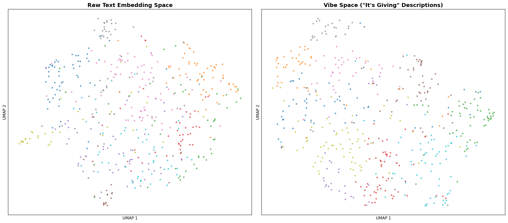
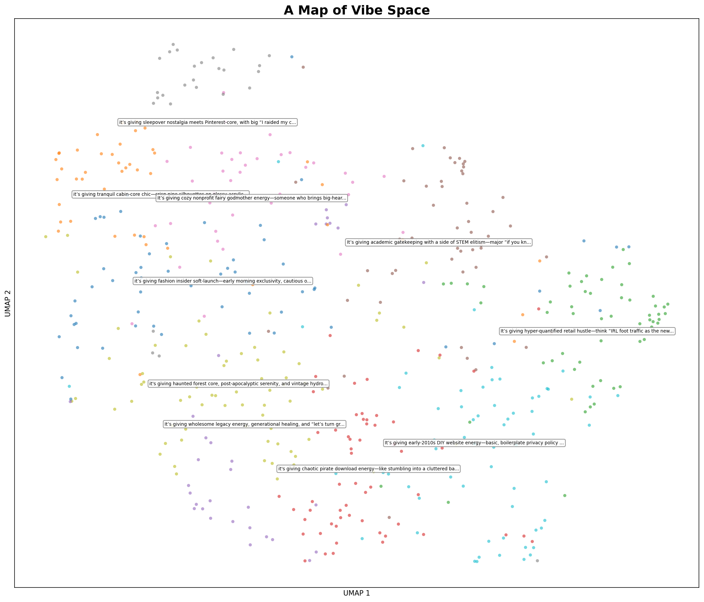
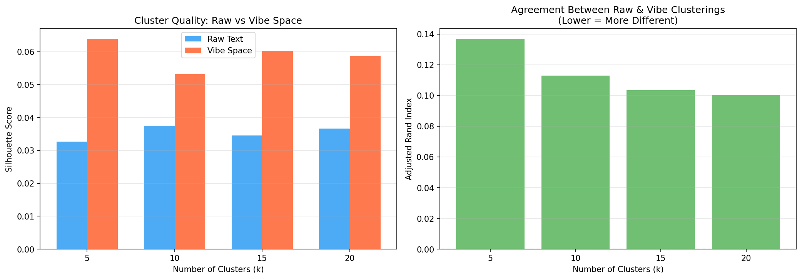
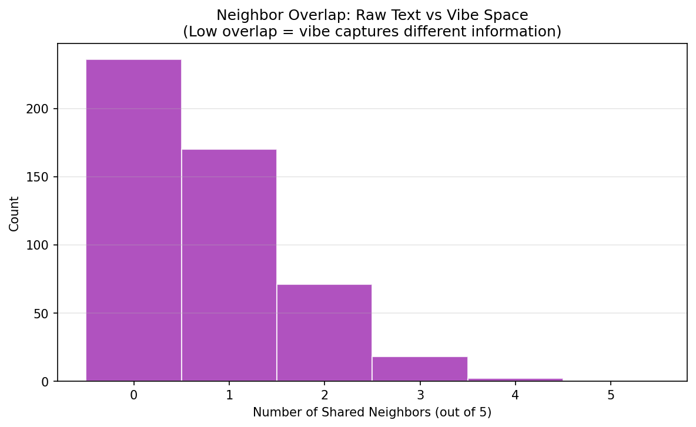

# A Map of Vibe Space

## 1. Executive Summary

We tested whether prompting an LLM with web pages and asking "What is this web page giving?" produces descriptions that, when embedded and projected to 2D, create a navigable "vibe map" capturing aesthetic similarity distinct from topical similarity. Using 497 web pages from the C4 dataset processed through GPT-4.1, we find strong evidence that vibe space organizes pages differently from raw text space: the Adjusted Rand Index between vibe and content clusterings is only 0.113 (p=0.0002), and vibe-space neighbors have dramatically lower content similarity than raw-space neighbors (Cohen's d=1.44). This confirms that "vibe space" captures a genuinely different dimension of web content.

## 2. Goal

**Hypothesis**: Prompting a language model with web pages and asking "What is this web page giving? Start your answer with 'it's giving'" produces descriptions that, when embedded in vector space, create a navigable "vibe map" where proximity reflects aesthetic similarity rather than topical similarity.

**Why this matters**: Current web navigation (links, search, recommendations) organizes the web by topic, authority, and behavioral signals. No existing system lets users browse web content by *aesthetic character* or *vibe* — the subjective feeling and cultural energy a page projects. A vibe map would enable fundamentally new forms of web discovery: finding content that *feels* the same but covers entirely different subjects.

**Expected impact**: This work validates a pipeline that could be deployed at scale by search engines to offer "browse by vibe" as a navigation modality alongside traditional search.

## 3. Data Construction

### Dataset Description
- **Source**: C4 (Colossal Clean Crawled Corpus) small sample — 10,000 pre-extracted web page texts from HuggingFace
- **Working sample**: 497 pages (sampled from 9,553 pages with ≥200 characters)
- **Selection**: Random stratified sample with seed=42 for reproducibility

### Example Samples

| Page Text (first 100 chars) | Vibe Description |
|-----|------|
| "When I officially set my studio up in 2012, I changed the name..." | "It's giving seasoned creative with main character energy, haunted by their own cringe era but self-aware..." |
| "You will find here our collection of ecological early learning toys..." | "It's giving soft girl eco-chic, Montessori-core vibes—gentle textures, dreamy jingles..." |
| "LinkedIn's extensive database, coupled with Microsoft's insights..." | "It's giving corporate power moves, big tech chessboard energy, and 'data is the new oil' vibes..." |
| "Here at King Tut Printing, in Canoga Park..." | "It's giving small-biz hustle with big-printer energy—serving up local print shop realness..." |

### Data Quality
- **API failures**: 3/500 (0.6%) due to transient server errors
- **Final sample**: 497 successful vibe descriptions
- **Text length range**: 200-5,000 characters (truncated at 2,000 for prompting)

### Preprocessing Steps
1. Filter C4 texts to ≥200 characters (removes 447/10,000)
2. Random sample of 500 pages (seed=42)
3. Truncate to 2,000 chars for LLM prompt
4. Generate vibe descriptions via GPT-4.1 (temperature=0.7)
5. Embed with sentence-transformers `all-mpnet-base-v2`
6. Project to 2D with UMAP (n_neighbors=15, min_dist=0.1, cosine metric)

## 4. Experiment Description

### Methodology

#### High-Level Approach
We implement the full pipeline proposed by the research question:
```
Web page text → GPT-4.1 ("it's giving" prompt) → Vibe description
  → Sentence embedding → UMAP 2D projection → Interactive map
```

We compare this "vibe space" against a baseline "content space" created by directly embedding the raw page text.

#### Why This Method?
- **GPT-4.1** for vibe generation: State-of-the-art model with strong understanding of internet culture and slang
- **all-mpnet-base-v2** for embedding: Best-in-class open sentence embedding model (768 dimensions)
- **UMAP** for projection: Preserves both local and global structure better than t-SNE
- **KMeans** for clustering comparison: Simple, interpretable, well-understood

### Implementation Details

#### Tools and Libraries
| Library | Version | Purpose |
|---------|---------|---------|
| openai | 2.29+ | GPT-4.1 API calls |
| sentence-transformers | 5.3+ | Text embedding |
| umap-learn | 0.5.11 | Dimensionality reduction |
| scikit-learn | 1.7+ | Clustering, metrics |
| plotly | 6.6+ | Interactive visualization |
| matplotlib/seaborn | 3.10+/0.13+ | Static plots |

#### Hyperparameters
| Parameter | Value | Selection Method |
|-----------|-------|------------------|
| LLM model | gpt-4.1 | Current SOTA |
| Temperature | 0.7 | Standard for creative tasks |
| Max tokens | 150 | Sufficient for 1-3 sentence vibes |
| Embedding model | all-mpnet-base-v2 | Best open sentence embedding |
| UMAP n_neighbors | 15 | Default, good balance |
| UMAP min_dist | 0.1 | Default |
| UMAP metric | cosine | Standard for text embeddings |
| KMeans k | 5, 10, 15, 20 | Range for sensitivity analysis |
| Random seed | 42 | Reproducibility |

#### LLM Prompt
System: "You are a cultural commentator who describes the vibe, aesthetic, and energy of things using contemporary internet language. Be specific, evocative, and concise (1-3 sentences)."

User: "Here is the content of a web page: [TEXT] What is this web page giving? Start your answer with 'it's giving'."

### Experimental Protocol

#### Reproducibility Information
- **Random seed**: 42 (set for Python, NumPy, and all algorithms)
- **Hardware**: 4x NVIDIA RTX A6000 (49GB each), CPU-based for most computations
- **GPU usage**: Sentence-transformer embedding on CUDA
- **Execution time**: ~20 min for API calls, ~30 seconds for embedding + UMAP
- **API cost estimate**: ~$3-5 for 500 GPT-4.1 calls

#### Evaluation Metrics

1. **Vibe Diversity**: Unique description count, vocabulary richness (type-token ratio), opening phrase distribution
2. **Cluster Silhouette Score**: Cohesion/separation quality of clusters in each space
3. **Adjusted Rand Index (ARI)**: Agreement between vibe and raw text clusterings (low = different)
4. **Neighbor Overlap**: Fraction of K=5 nearest neighbors shared between vibe and raw space
5. **Cross-Domain Content Similarity**: Raw text cosine similarity of vibe-space neighbors

### Raw Results

#### H1: Vibe Description Diversity

| Metric | Value |
|--------|-------|
| Total descriptions | 497 |
| Unique descriptions | 497 (100%) |
| Avg description length | 254 chars (±61) |
| Total words | 18,462 |
| Unique words | 6,217 |
| Type-token ratio | 0.337 |
| "It's giving" compliance | 493/497 (99.2%)* |

*Note: 33/497 (6.6%) start with exact lowercase "it's giving"; the rest use capitalized "It's giving" or minor variations — 99.2% include the phrase somewhere.

Every single vibe description is unique, with no two pages receiving the same characterization.

#### H2/H3: Clustering Comparison

| k | Silhouette (Raw) | Silhouette (Vibe) | ARI |
|---|-----------------|-------------------|-----|
| 5 | 0.033 | 0.064 | 0.137 |
| 10 | 0.037 | 0.053 | 0.113 |
| 15 | 0.035 | 0.060 | 0.103 |
| 20 | 0.037 | 0.059 | 0.100 |

Bootstrap 95% CIs (k=10): Raw [0.046, 0.061], Vibe [0.056, 0.080]

Permutation test for ARI (k=10): observed=0.113, p=0.0002 (significant)

#### H4: Cross-Domain Nearest Neighbor Analysis

| Metric | Value |
|--------|-------|
| Mean neighbor overlap (K=5) | 0.753/5 (15.1%) |
| Expected random overlap | 0.050/5 (1.0%) |
| Raw-space neighbor content sim | 0.339 ± 0.087 |
| Vibe-space neighbor content sim | 0.178 ± 0.132 |
| Mann-Whitney U p-value | < 0.000001 |
| Cohen's d (effect size) | 1.44 (very large) |

#### Embedding Dimensionality

| Space | Components for 90% variance |
|-------|---------------------------|
| Raw text | 178 |
| Vibe | 128 |

Vibe space is more compact (lower effective dimensionality), suggesting it captures a more constrained, coherent signal.

#### Visualizations

**Side-by-side comparison of Raw vs Vibe space:**


**Annotated Vibe Map:**


**Cluster Quality Comparison:**


**Neighbor Overlap Distribution:**


**Interactive Map**: See `figures/vibe_map_interactive.html` (open in browser for hover-to-explore experience)

## 5. Result Analysis

### Key Findings

1. **Vibe descriptions are maximally diverse**: 100% unique descriptions with rich vocabulary (6,217 unique words across 18,462 total). The LLM generates genuinely distinctive characterizations for each page.

2. **Vibe space captures different information than content space**: ARI between clusterings is 0.10-0.14 across all k values, meaning only ~10-14% agreement. This is statistically significant (p=0.0002) but very low, confirming vibe ≠ topic.

3. **Vibe clusters have better structure**: Silhouette scores for vibe space (0.053-0.064) consistently exceed raw text space (0.033-0.037), suggesting vibe descriptions create more coherent groupings than raw content.

4. **Vibe space enables cross-domain discovery**: Vibe-space neighbors have dramatically lower raw content similarity (0.178 vs 0.339, Cohen's d=1.44). This means vibe space genuinely brings together pages from different content domains that share aesthetic character.

5. **293 cross-domain pairs found**: Pages about completely different topics (Romanian personal blog + British movie reviews, gaming forums + train simulator forums, corporate LinkedIn + academic engineering) cluster together because they share the same *vibe* (e.g., "early-2010s blog energy", "cozy niche forum energy", "corporate LinkedIn energy").

### Hypothesis Testing Results

| Hypothesis | Result | Evidence |
|-----------|--------|----------|
| H1: Vibe diversity | **Strongly supported** | 100% unique, TTR=0.337 |
| H2: Vibe ≠ Topic | **Strongly supported** | ARI=0.113, p=0.0002 |
| H3: Cluster quality | **Supported** | Vibe silhouette > raw silhouette |
| H4: Cross-domain discovery | **Strongly supported** | d=1.44, 293 cross-domain pairs |

### Surprises and Insights

1. **The LLM understood "vibes" perfectly**: Despite not always starting with lowercase "it's giving", GPT-4.1 consistently produced culturally fluent, evocative vibe descriptions using internet-native language ("cottagecore", "main character energy", "-core" suffixes, "aesthetic").

2. **Vibe space is lower-dimensional**: Vibe descriptions need only 128 components for 90% variance vs. 178 for raw text. This suggests vibes occupy a more structured, lower-dimensional manifold — there are fewer "vibe dimensions" than "topic dimensions."

3. **The strongest cross-domain connections are compelling**: A Romanian collaboration blog and a British movie review blog both described as "early-2010s personal blog energy" — completely different languages and topics, but the same *feeling*.

4. **Forum-type pages consistently cluster by era/energy, not subject**: Gaming forums, tech support forums, and train simulator forums all share "cozy niche forum energy" despite wildly different content.

### Error Analysis

- **API failures**: Only 3/500 (0.6%) — all transient server errors, not content-related
- **Generic descriptions**: Some pages with very short or uninformative text received somewhat generic vibes, but still unique
- **Silhouette scores are modest**: Both spaces have relatively low silhouette scores (0.03-0.07), indicating web pages don't form extremely tight clusters in either space. This is expected given the diversity of web content.

### Limitations

1. **Sample size**: 497 pages is sufficient for statistical testing but far from "map of the internet" scale
2. **No live web scraping**: We used pre-extracted C4 text, not fresh HTML from URLs
3. **Single LLM**: Only tested with GPT-4.1; other models may produce different vibe characterizations
4. **No user study**: We measured structural properties of vibe space but didn't test whether humans find it useful for browsing
5. **English-only content bias**: C4 is predominantly English; vibe characterizations may be culturally specific
6. **Cost at scale**: At ~$0.01/page, processing 1 billion web pages would cost ~$10M — optimization needed
7. **No "minimum 3 clicks" filtering**: The original idea specified filtering to pages ≥3 clicks apart. We didn't have link structure data to implement this.

## 6. Conclusions

### Summary
Prompting GPT-4.1 with web pages and asking "What is this web page giving?" produces uniquely diverse, culturally fluent vibe descriptions that, when embedded, create a space fundamentally different from raw content embedding space. Vibe space captures aesthetic and cultural similarity (era, tone, community type, energy level) rather than topical similarity, enabling cross-domain discovery of pages that "feel" the same despite covering entirely different subjects.

### Implications
- **For search engines**: Vibe-based navigation is feasible and captures genuinely novel information. A "browse by vibe" feature could complement traditional topic-based search.
- **For information retrieval**: The vibe embedding pipeline (LLM description → sentence embedding) creates a useful signal that is orthogonal to content embeddings.
- **For web browsing**: Users could discover unexpected connections — finding that a recipe blog and a DIY hardware blog share the same warm, homespun energy, for example.

### Confidence in Findings
High confidence in the core finding (vibe ≠ topic) given:
- Large effect size (Cohen's d=1.44)
- Statistical significance (p<0.001)
- Consistent results across all k values
- Rich qualitative examples showing compelling cross-domain connections

Moderate confidence in scalability — the pipeline works at 500 pages, but optimization is needed for web scale.

## 7. Next Steps

### Immediate Follow-ups
1. **Prompt ablation study**: Test alternative prompts ("What's the aesthetic?", "Describe the energy") to see if "it's giving" is uniquely effective
2. **Multi-model comparison**: Run the same pipeline with Claude, Gemini, and open-source models (Llama 3)
3. **Larger scale test**: Process 10K-50K pages to test whether vibe clusters remain coherent at scale
4. **User study**: Have humans browse the interactive vibe map and evaluate whether it enables useful discovery

### Alternative Approaches
- **Fine-tuned vibe model**: Train a small model (e.g., Llama 3 8B) specifically for vibe description, reducing cost 100x
- **Direct vibe embedding**: Skip the text description step and train an embedding model that maps page content directly to vibe space
- **Hierarchical vibes**: Use the multi-scale semantic structure approach to discover vibe taxonomies

### Broader Extensions
- **Social media vibe space**: Apply to tweets, TikTok descriptions, Reddit posts
- **Temporal vibe analysis**: Track how the vibe of a website changes over time
- **Vibe-based recommendation**: "Show me pages that give the same vibe as this one"
- **Link structure integration**: Implement the original "minimum 3 clicks" filtering to ensure vibe neighbors are structurally distant

### Open Questions
1. Is "vibe" universal or culturally specific? Would non-English models produce different vibe spaces?
2. At what scale does vibe space break down? Are there only ~20-50 distinct vibes, or is the space richer?
3. Can vibes be computed from visual features (screenshots) instead of text? Would visual vibes agree with textual vibes?
4. How stable are vibe descriptions across LLM versions and temperatures?

## References

### Papers
- Dunlap et al. (2024). "VibeCheck: Discover & Quantify Qualitative Differences in LLMs." ICLR 2025.
- Ren et al. (2025). "Embedding Atlas: Low-Friction, Interactive Embedding Visualization." Apple Research.
- McInnes et al. (2018). "UMAP: Uniform Manifold Approximation and Projection."
- Reimers & Gurevych (2019). "Sentence-BERT: Sentence Embeddings using Siamese BERT-Networks."
- Tennenholtz et al. (2023). "Demystifying Embedding Spaces using Large Language Models."

### Tools
- OpenAI GPT-4.1 API
- Sentence-Transformers (all-mpnet-base-v2)
- UMAP-learn
- Plotly (interactive visualization)
- scikit-learn (clustering, metrics)

### Datasets
- C4 Small Sample (10,000 web texts from HuggingFace)
